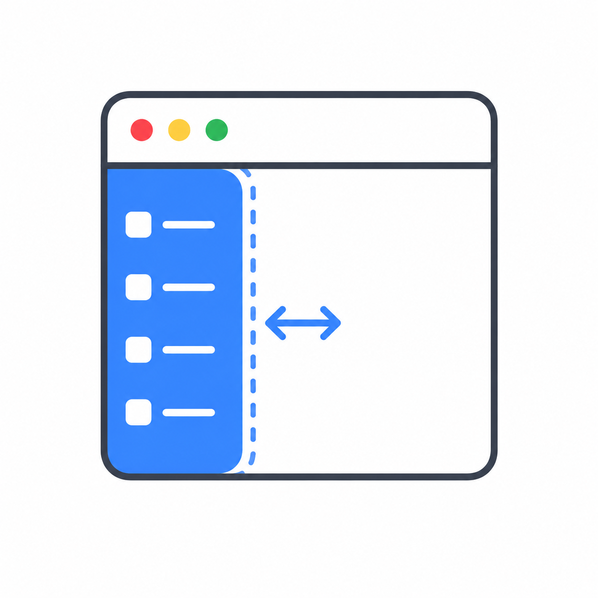

<p align="center">
  
</p>

<h1 align="center">Chrome-Vertical-Tab-Sidebar-Toggle</h1>

<p align="center">
  <strong>Affichez/masquez la barre latérale d'onglets verticaux native de Chrome avec un raccourci clavier.</strong><br>
  macOS (Hammerspoon) et Windows (AutoHotkey) — raccourci clavier, déclenchement par bord de l'écran, ou les deux.
</p>

<p align="center">
  <a href="README.md">English</a> · <a href="README.zh-CN.md">简体中文</a> · <a href="README.zh-TW.md">繁體中文</a> · <a href="README_ja.md">日本語</a> · <a href="README_ko.md">한국어</a> · <a href="README_es.md">Español</a> · <a href="README_pt-BR.md">Português</a> · <a href="README_ru.md">Русский</a> · Français · <a href="README_de.md">Deutsch</a>
</p>

---

## Fonctionnalités

Chrome dispose d'une barre latérale d'onglets verticaux intégrée, mais aucun raccourci clavier ne permet de l'afficher ou de la masquer. Ce projet en ajoute un. Il localise le bouton « Expand Tabs » / « Collapse Tabs » de Chrome dans l'arbre d'accessibilité du système d'exploitation et le presse pour vous — à l'aide de Hammerspoon sur macOS, et d'AutoHotkey sur Windows. Même approche que [ChromeSidebarToggleRaycast](https://github.com/RotulPlastik/ChromeSidebarToggleRaycast).

## Démo

https://github.com/user-attachments/assets/bcf2a76a-8028-4b63-bc8a-f0b9e1178a25

## Choisissez votre plateforme

| Plateforme | Fonctionnement | Pour commencer |
|------------|----------------|----------------|
| **macOS** | Hammerspoon + API d'Accessibilité. Clavier, bord de l'écran, ou les deux. | [Installation → macOS](#installation) ↓ |
| **Windows** | AutoHotkey v2 + UI Automation. Clavier uniquement (`Ctrl+S`). | [Installation → Windows](#installation) ↓ |

Les deux plateformes sont entièrement documentées sur cette page : voir la [référence macOS](#macos-reference) et la [référence Windows](#windows-reference) ci-dessous.

## Paramètres régionaux Chrome pris en charge

Le script compare les libellés des boutons de la barre latérale dans l'arbre d'accessibilité de Chrome. Il fonctionne directement avec ces paramètres régionaux :

| Langue | Paramètre régional | Développer les onglets | Réduire les onglets |
|--------|---------------------|------------------------|---------------------|
| Anglais | `en` | Expand tabs | Collapse tabs |
| Chinois traditionnel | `zh-TW` / `zh-HK` | 展開分頁 | 收合分頁 |
| Chinois simplifié | `zh-CN` | 展开标签页 | 收起标签页 |
| Japonais | `ja` | タブを開く | タブを閉じる |
| Coréen | `ko` | 탭 펼치기 | 탭 접기 |
| Allemand | `de` | Tabs maximieren | Tabs minimieren |
| Espagnol | `es` | Mostrar pestañas | Ocultar pestañas |
| Français | `fr` | Développer les onglets | Réduire les onglets |
| Portugais (Brésil) | `pt-BR` | Mostrar guias | Ocultar guias |
| Russe | `ru` | Развернуть вкладки | Свернуть вкладки |

Pour ajouter une autre langue, trouvez le libellé du bouton dans votre paramètre régional Chrome et ajoutez-le au tableau `SIDEBAR_LABELS` — dans `init.lua` (macOS) ou `windows/ChromeVTabToggle.ahk` (Windows).

## Activer la barre latérale d'onglets verticaux dans Chrome

La barre latérale d'onglets verticaux n'est pas activée par défaut. Pour l'activer :

1. Tapez `chrome://flags/#vertical-tabs` dans la barre d'adresse
2. Changez **Vertical tabs** en **Enabled**
3. Cliquez sur **Relaunch** pour redémarrer Chrome
4. Après le redémarrage, faites un clic droit sur une zone vide de la barre d'onglets pour voir l'option

## Installation

Choisissez votre plateforme. Les deux font la même chose ; seul l'outillage diffère.

<details open>
<summary><b>macOS</b> — Hammerspoon (clavier / bord de l'écran / les deux)</summary>

**Prérequis :** macOS 13+, [Hammerspoon](https://www.hammerspoon.org), Chrome avec la barre latérale d'onglets verticaux activée, et l'autorisation d'accessibilité accordée à Hammerspoon.

1. Installez Hammerspoon :

   ```bash
   brew install --cask hammerspoon
   ```

2. Choisissez une version et copiez-la dans la configuration Hammerspoon :

   **Version avec schémas** (trois modes, par défaut) :
   ```bash
   cp init.lua ~/.hammerspoon/init.lua
   ```

   **Version clavier uniquement** :
   ```bash
   cp init-keyboard-only.lua ~/.hammerspoon/init.lua
   ```

   Si vous avez déjà un `~/.hammerspoon/init.lua`, ajoutez le contenu à la fin.

3. Accordez l'autorisation d'accessibilité :
   - Réglages Système → Confidentialité et sécurité → Accessibilité
   - Ajoutez et activez Hammerspoon

4. Rechargez la configuration Hammerspoon (cliquez sur l'icône de la barre de menus → Recharger la configuration)

5. (Facultatif) Ajoutez Hammerspoon aux éléments de connexion pour un démarrage automatique :
   - Réglages Système → Général → Ouverture
   - Ajoutez Hammerspoon

Voir la [configuration macOS](#schemes-macos-initlua) ci-dessous pour les schémas, les déclencheurs et la personnalisation du raccourci.

</details>

<details open>
<summary><b>Windows</b> — AutoHotkey v2 (clavier uniquement, <code>Ctrl+S</code>)</summary>

**Prérequis :** Windows 10/11, [AutoHotkey **v2**](https://www.autohotkey.com/), [le fichier `UIA.ahk` de Descolada](https://github.com/Descolada/UIA-v2) (à télécharger séparément), et Chrome avec la barre latérale d'onglets verticaux activée.

1. Installez **AutoHotkey v2** depuis <https://www.autohotkey.com/> (pas v1.1).

2. Téléchargez **`UIA.ahk`** depuis [Descolada/UIA-v2](https://github.com/Descolada/UIA-v2) (`Lib/UIA.ahk`) et placez-le dans le dossier `windows/`, à côté de `ChromeVTabToggle.ahk` :

   ```
   windows/
   ├── ChromeVTabToggle.ahk
   └── UIA.ahk          ← vous téléchargez ceci (~400 Ko, tiers, absent de ce dépôt)
   ```

3. Double-cliquez sur `windows/ChromeVTabToggle.ahk` pour l'exécuter. Une notification dans la zone de notification confirme son démarrage.

4. Appuyez sur **`Ctrl+S`** lorsque Chrome est au premier plan pour basculer la barre latérale. (`Ctrl+S` enregistre toujours normalement dans toutes les autres applications.)

5. (Facultatif) Démarrage automatique à l'ouverture de session : appuyez sur `Win+R`, tapez `shell:startup`, et déposez un **raccourci** vers `ChromeVTabToggle.ahk` dans ce dossier.

Pour la personnalisation du raccourci et le dépannage, voir les [notes détaillées Windows](windows/README.md).

</details>

---

# macOS reference

Les sections ci-dessous s'appliquent à la version **macOS (Hammerspoon)**. La [référence Windows](#windows-reference) suit plus bas.

## Schemes (macOS, `init.lua`)

Modifiez la variable `SCHEME` en haut du fichier `init.lua` pour choisir un mode :

| Schéma | Valeur | Déclencheurs |
|--------|--------|--------------|
| Clavier uniquement | `1` | `Cmd+S` bascule la barre latérale |
| Bord de l'écran uniquement | `2` | Survolez le bord gauche de l'écran pour développer, déplacez au-delà de 380px pour réduire |
| Clavier + Souris | `3` | Les deux déclencheurs actifs (par défaut) |

```lua
local SCHEME = 3  -- 1 = Clavier, 2 = Bord de l'écran, 3 = Les deux
```

Lorsque Chrome n'est pas l'application au premier plan, tous les déclencheurs sont automatiquement désactivés.

## Déclencheurs (macOS)

| Déclencheur | Action | Schéma |
|-------------|--------|--------|
| `Cmd+S` | Basculer la barre latérale | 1 & 3 |
| Souris sur le bord gauche (0-2px) pendant 0,15 s | Développer la barre latérale | 2 & 3 |
| Souris se déplace au-delà de 380px du bord gauche | Réduire la barre latérale | 2 & 3 |

## Débogage (macOS)

| Raccourci | Action |
|-----------|--------|
| `Cmd+Alt+D` | Afficher l'état du service |
| `Cmd+Alt+B` | Exporter tous les boutons AX de Chrome dans la console |
| `Cmd+Alt+R` | Forcer le redémarrage de tous les services |

## Configuration (macOS)

### Sélecteur de schéma (`init.lua`)

```lua
local SCHEME = 3  -- 1 = Clavier, 2 = Bord de l'écran, 3 = Les deux
```

### Seuils du bord de l'écran (`init.lua`, schémas 2 & 3)

```lua
local EDGE_THRESHOLD    = 2       -- pixels depuis le bord gauche pour déclencher
local EXIT_THRESHOLD    = 380     -- pixels depuis le bord gauche pour réduire
local WAIT_TIME         = 0.15    -- temps d'attente en secondes avant déclenchement (0,15 s)
local MOUSE_POLL_INTERVAL = 0.05  -- secondes entre les vérifications de position de la souris
```

### Les deux versions

```lua
local DEBUG = true  -- afficher les messages de débogage dans la console
```

## Personnaliser le raccourci clavier (macOS)

Disponible dans `init.lua` et `init-keyboard-only.lua`. Le raccourci par défaut est `Cmd+S`, qui remplace le raccourci natif de Chrome pour « Enregistrer la page ». Pour le modifier, éditez la vérification de touche dans la fonction `createKeyTap` :

```lua
-- Cmd+S -> toggle sidebar
if flags.cmd and not flags.ctrl and not flags.alt and not flags.shift
    and keyCode == keycodes.map["s"] then
```

### Touches modificatrices

Modifiez les conditions `flags.*` pour définir la combinaison de modificateurs souhaitée :

| Modificateur | Flag | Exemple |
|--------------|------|---------|
| Cmd | `flags.cmd` | `flags.cmd and not flags.ctrl` |
| Ctrl | `flags.ctrl` | `flags.ctrl and not flags.cmd` |
| Alt/Option | `flags.alt` | `flags.alt` |
| Shift | `flags.shift` | `flags.shift` |

Définissez le flag sur `true` pour l'exiger, `not flags.xxx` pour l'exclure.

### Code de touche

Changez `keycodes.map["s"]` par n'importe quel nom de touche. Exemples courants :

```lua
keycodes.map["s"]       -- S
keycodes.map["b"]       -- B
keycodes.map["/"]       -- /
keycodes.map["return"]  -- Return/Entrée
keycodes.map["space"]   -- Espace
keycodes.map["f1"]      -- F1
```

Liste complète des noms de touches : exécutez `hs.keycodes.map` dans la console Hammerspoon.

### Exemples

**`Ctrl+Shift+B`** :
```lua
if flags.ctrl and not flags.cmd and flags.shift and not flags.alt
    and keyCode == keycodes.map["b"] then
```

**`Cmd+Alt+/`** :
```lua
if flags.cmd and not flags.ctrl and flags.alt and not flags.shift
    and keyCode == keycodes.map["/"] then
```

**`Cmd+Shift+Return`** :
```lua
if flags.cmd and not flags.ctrl and not flags.alt and flags.shift
    and keyCode == keycodes.map["return"] then
```

Après modification, rechargez la configuration Hammerspoon pour appliquer les changements.

## Comment ça fonctionne (macOS)

1. Un `eventtap` intercepte `Cmd+S` lorsque Chrome est au premier plan (schémas 1 & 3)
2. Un sondage de position de la souris (50Hz) détecte le survol du bord gauche et la sortie (schémas 2 & 3)
3. Les deux déclencheurs appellent `toggleSidebar()` qui :
   - Obtient l'élément racine `AXUIElement` de Chrome via `hs.axuielement.applicationElement()`
   - Recherche dans les fenêtres un bouton avec `AXDescription` correspondant à « Expand Tabs » ou « Collapse Tabs »
   - Appelle `performAction("AXPress")` sur le bouton trouvé
4. Un mécanisme de « watchdog » détecte si le sondage de la souris échoue et le redémarre automatiquement (schémas 2 & 3)
5. Un délai de tolérance empêche les déclenchements intempestifs lors du changement d'applications

---

# Windows reference


Les sections ci-dessous s'appliquent à la version **Windows (AutoHotkey)**. Voir les [notes Windows](windows/README.md) pour le démarrage automatique et le dépannage.

## Utilisation (Windows)

| Raccourci | Action |
|-----------|--------|
| `Ctrl+S` (dans Chrome) | Basculer la barre latérale d'onglets verticaux |
| `Ctrl+S` (ailleurs) | Transmis comme le raccourci d'enregistrement normal |
| `Ctrl+Alt+Q` | Quitter le script |

Le script n'intercepte `Ctrl+S` que lorsque la fenêtre active est une fenêtre Chromium (classe de fenêtre `Chrome_WidgetWin_1`), de sorte que l'enregistrement fonctionne toujours dans toutes les autres applications.

## Personnaliser le raccourci (Windows)

Le raccourci par défaut est `Ctrl+S`. Pour utiliser une autre touche, éditez la ligne du raccourci dans `windows/ChromeVTabToggle.ahk` :

```autohotkey
$^s:: {        ; ^ = Ctrl, ! = Alt, + = Shift, # = Win
```

Par exemple, `Ctrl+Alt+S` serait `$^!s::`. Si vous abandonnez `Ctrl+S`, vous pouvez également supprimer la branche de transmission `{Blind}^s` puisqu'il n'y a plus de raccourci natif à préserver.

## Comment ça fonctionne (Windows)

1. Un raccourci global `Ctrl+S` vérifie si la fenêtre active est Chromium (`WinGetClass = "Chrome_WidgetWin_1"`). Sinon, il transmet `Ctrl+S`.
2. `UIA.ElementFromHandle()` obtient la racine UI Automation de la fenêtre active.
3. `FindSidebarButton()` parcourt l'arbre UIA à la recherche d'un bouton dont le nom correspond à un libellé de `SIDEBAR_LABELS`.
4. `button.Invoke()` bascule la barre latérale — l'équivalent UIA de `AXPress` sur macOS.

## Fichiers

| Fichier | Description |
|---------|-------------|
| `init.lua` | Version à trois schémas (clavier / souris / les deux) — macOS |
| `init-keyboard-only.lua` | Version clavier uniquement, sans détection de souris — macOS |
| `windows/ChromeVTabToggle.ahk` | Portage Windows (AutoHotkey v2, clavier uniquement) |
| `windows/README.md` | Référence complète Windows (personnalisation, dépannage) |

## Crédits

- Concept original : [ChromeSidebarToggleRaycast](https://github.com/RotulPlastik/ChromeSidebarToggleRaycast) par RotulPlastik
- Adapté pour Hammerspoon avec déclenchement par bord de l'écran

## Licence

MIT
